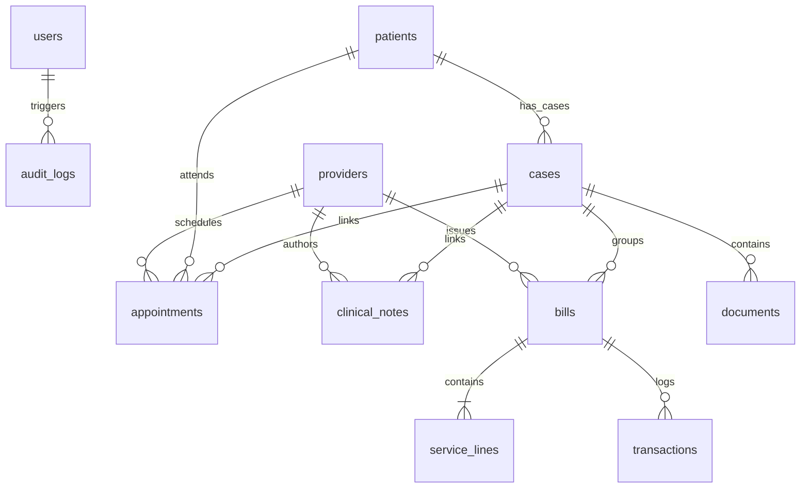

# Database Schema Specification (Proposed)

This document details the relational database schema design (optimized for PostgreSQL/MySQL) mapped to support the clinical platform's data objects and services.

---

## 1. Entity-Relationship Schema Map

---

## 2. Table Schemas & Constraints

### 2.1. `users`
Stores user accounts, login credentials, and roles.
* **Columns**:
  * `id` (UUID, Primary Key)
  * `email` (VARCHAR(150), Unique, Not Null)
  * `password_hash` (VARCHAR(255), Not Null)
  * `full_name` (VARCHAR(100), Not Null)
  * `role` (VARCHAR(50), Not Null) - e.g., 'Super Admin', 'Receptionist', 'Doctor', etc.
  * `mfa_secret` (VARCHAR(100), Nullable)
  * `created_at` (TIMESTAMP, Default NOW())
* **Indexes**: Unique index on `email`.

### 2.2. `providers`
Stores credentials and identifiers for the four billing practices.
* **Columns**:
  * `id` (VARCHAR(50), Primary Key) - e.g., 'prov-josmic', 'prov-davs'
  * `name` (VARCHAR(150), Not Null)
  * `business_name` (VARCHAR(200), Not Null)
  * `service_category` (VARCHAR(100))
  * `tax_id` (VARCHAR(50), Not Null)
  * `npi` (VARCHAR(50), Not Null)
  * `ssn_or_ein` (VARCHAR(10), Default 'EIN')
  * `street` (VARCHAR(200))
  * `suite` (VARCHAR(50))
  * `city` (VARCHAR(100))
  * `state` (VARCHAR(10))
  * `zip_code` (VARCHAR(20))
  * `phone` (VARCHAR(20))
  * `email` (VARCHAR(150))
  * `rendering_provider_name` (VARCHAR(100))
  * `rendering_provider_credentials` (VARCHAR(50))
  * `rendering_provider_npi` (VARCHAR(50))
  * `status` (VARCHAR(50), Default 'ACTIVE')

### 2.3. `patients`
Stores client/patient demographic details.
* **Columns**:
  * `id` (VARCHAR(50), Primary Key) - e.g. '141849159'
  * `first_name` (VARCHAR(100), Not Null)
  * `middle_name` (VARCHAR(100))
  * `last_name` (VARCHAR(100), Not Null)
  * `dob` (DATE, Not Null)
  * `sex` (VARCHAR(10), Not Null)
  * `phone` (VARCHAR(20))
  * `email` (VARCHAR(150))
  * `ssn` (VARCHAR(50), Masked, Nullable)
  * `street` (VARCHAR(200))
  * `city` (VARCHAR(100))
  * `state` (VARCHAR(10))
  * `zip_code` (VARCHAR(20))
  * `created_at` (TIMESTAMP, Default NOW())
* **Indexes**: Index on `last_name`, `dob`.

### 2.4. `cases`
Stores accident cases linking patients to attorneys and insurance details.
* **Columns**:
  * `id` (VARCHAR(50), Primary Key) - e.g., 'case-99201'
  * `patient_id` (VARCHAR(50), Foreign Key referencing `patients.id`, Not Null)
  * `accident_date` (DATE, Not Null)
  * `accident_type` (VARCHAR(100), Not Null) - e.g., 'AUTO_ACCIDENT'
  * `accident_state` (VARCHAR(10), Not Null)
  * `insurance_carrier` (VARCHAR(150))
  * `insurance_policy_number` (VARCHAR(100))
  * `insurance_claim_number` (VARCHAR(100))
  * `attorney_firm_name` (VARCHAR(150))
  * `lop_signed` (BOOLEAN, Default FALSE)
  * `diagnosis_codes` (VARCHAR(50) ARRAY) - array of initial diagnosis codes
  * `status` (VARCHAR(50), Default 'OPEN')
  * `created_at` (TIMESTAMP, Default NOW())
* **Indexes**: Index on `patient_id`.

### 2.5. `appointments`
Tracks scheduled visits and matching reminder SMS/Email flags.
* **Columns**:
  * `id` (VARCHAR(50), Primary Key)
  * `patient_id` (VARCHAR(50), Foreign Key referencing `patients.id`, Not Null)
  * `case_id` (VARCHAR(50), Foreign Key referencing `cases.id`, Nullable)
  * `provider_id` (VARCHAR(50), Foreign Key referencing `providers.id`, Not Null)
  * `appointment_date` (DATE, Not Null)
  * `start_time` (VARCHAR(20), Not Null) - e.g., '08:30 AM'
  * `end_time` (VARCHAR(20), Not Null)
  * `status` (VARCHAR(50), Default 'SCHEDULED') - e.g., 'CHECKED_IN', 'CANCELLED'
  * `booking_ref` (VARCHAR(50))
  * `booking_channel` (VARCHAR(100))
  * `reminder_status` (VARCHAR(100))
  * `reason_for_visit` (TEXT)
  * `created_at` (TIMESTAMP, Default NOW())
* **Indexes**: Index on `patient_id`, `appointment_date`.

### 2.6. `clinical_notes`
Clinical SOAP narrative reports authored by clinicians.
* **Columns**:
  * `id` (VARCHAR(50), Primary Key)
  * `patient_id` (VARCHAR(50), Foreign Key referencing `patients.id`, Not Null)
  * `case_id` (VARCHAR(50), Foreign Key referencing `cases.id`, Not Null)
  * `provider_id` (VARCHAR(50), Foreign Key referencing `providers.id`, Not Null)
  * `note_type` (VARCHAR(50), Not Null) - e.g., 'PAIN_EVALUATION', 'ESWT_PROCEDURE'
  * `status` (VARCHAR(50), Default 'UNSIGNED') - e.g., 'SIGNED'
  * `signed_by` (VARCHAR(100))
  * `signed_at` (TIMESTAMP)
  * `soap_subjective` (TEXT)
  * `soap_objective` (TEXT)
  * `soap_assessment` (TEXT)
  * `soap_plan` (TEXT)
  * `anatomical_diagram_data` (JSONB) - stores plotted regions & findings coordinates
  * `created_at` (TIMESTAMP, Default NOW())
* **Indexes**: Index on `case_id`, `status`.

### 2.7. `bills`
Represents the primary ledger records for each provider under a patient case.
* **Columns**:
  * `id` (VARCHAR(50), Primary Key)
  * `case_id` (VARCHAR(50), Foreign Key referencing `cases.id`, Not Null)
  * `provider_id` (VARCHAR(50), Foreign Key referencing `providers.id`, Not Null)
  * `invoice_number` (VARCHAR(50), Unique)
  * `status` (VARCHAR(50), Default 'UNBILLED') - e.g. 'BILLED', 'PAID', 'PARTIALLY_PAID'
  * `created_at` (TIMESTAMP, Default NOW())
* **Indexes**: Unique index on `invoice_number`, index on `case_id`.

### 2.8. `service_lines`
Individual line items inside each bill. Enforces precise financial decimals.
* **Columns**:
  * `id` (VARCHAR(50), Primary Key)
  * `bill_id` (VARCHAR(50), Foreign Key referencing `bills.id`, Not Null)
  * `date_of_service` (DATE, Not Null)
  * `place_of_service` (VARCHAR(10), Default '11')
  * `cpt_code` (VARCHAR(10), Not Null)
  * `description` (VARCHAR(150))
  * `modifier_1` (VARCHAR(5))
  * `modifier_2` (VARCHAR(5))
  * `modifier_3` (VARCHAR(5))
  * `modifier_4` (VARCHAR(5))
  * `diagnosis_pointer` (VARCHAR(20))
  * `units` (INTEGER, Default 1)
  * `charge` (DECIMAL(10,2), Not Null)
  * `insurance_payment` (DECIMAL(10,2), Default 0.00)
  * `patient_payment` (DECIMAL(10,2), Default 0.00)
  * `other_payment` (DECIMAL(10,2), Default 0.00)
  * `adjustment` (DECIMAL(10,2), Default 0.00)
  * `balance` (DECIMAL(10,2), Not Null)
* **Indexes**: Index on `bill_id`.

### 2.9. `transactions`
Payment history log for posted settlement and adjustment checks.
* **Columns**:
  * `id` (VARCHAR(50), Primary Key)
  * `bill_id` (VARCHAR(50), Foreign Key referencing `bills.id`, Not Null)
  * `transaction_type` (VARCHAR(50), Not Null) - e.g., 'PAYMENT', 'ADJUSTMENT'
  * `source` (VARCHAR(50)) - e.g., 'INSURANCE', 'PATIENT'
  * `amount` (DECIMAL(10,2), Not Null)
  * `reference_number` (VARCHAR(100)) - check number
  * `notes` (TEXT)
  * `created_at` (TIMESTAMP, Default NOW())

### 2.10. `audit_logs`
Immutable HIPAA security log tracker.
* **Columns**:
  * `id` (BIGSERIAL, Primary Key)
  * `user_id` (VARCHAR(100), Not Null)
  * `user_name` (VARCHAR(100), Not Null)
  * `user_role` (VARCHAR(50), Not Null)
  * `action` (VARCHAR(100), Not Null) - e.g., 'VIEW_PHI', 'SIGN_NOTE', 'GENERATE_CLAIM'
  * `resource` (VARCHAR(250))
  * `ip_address` (VARCHAR(45))
  * `details` (TEXT)
  * `created_at` (TIMESTAMP, Default NOW())
* **Indexes**: Index on `created_at`, `user_id`.
