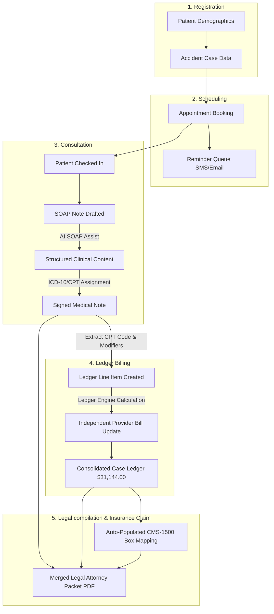
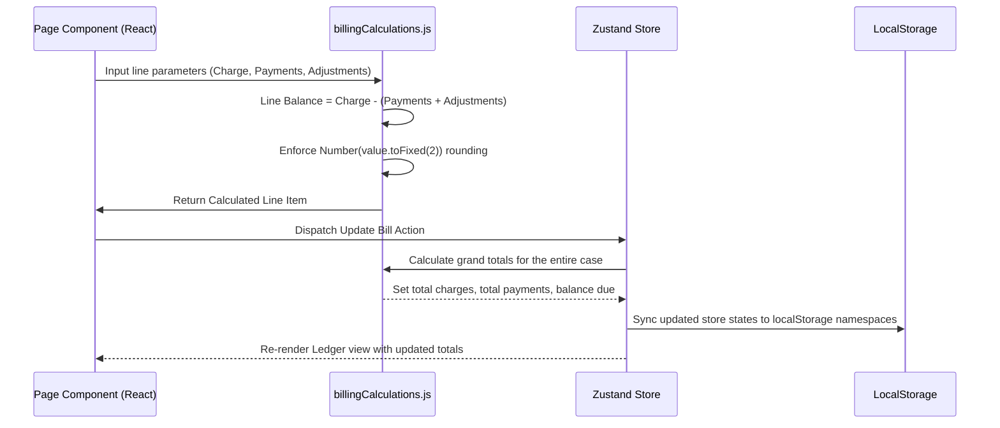
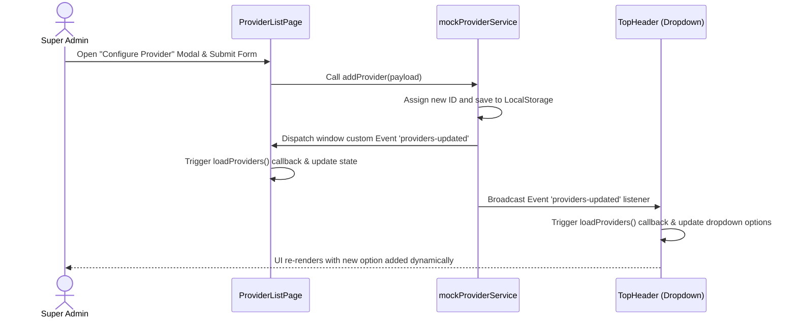

# Data Flow & State Transitions Specification (dataflow.md)

This specification details the lifecycle of data, flow sequence pathways, and entity state changes within the MedPractice Pro platform.

---

## 1. End-to-End Data Pipeline Flowchart

---

## 2. Key State Transition Lifecycles

Entities within the system transition through defined states as operations progress:

### 2.1. Appointment Status Transitions
* **`SCHEDULED`**: The default state when an appointment is booked by the receptionist.
* **`CHECKED_IN`**: The patient has arrived at the clinic. The record moves to the doctor/therapist's active queue.
* **`NO_SHOW`**: The patient missed the appointment.
* **`RESCHEDULED`**: The appointment date/time was modified (triggers check for holidays/weekends).
* **`CANCELLED`**: The appointment was removed, requiring a cancellation reason.

### 2.2. Clinical Note Status Transitions
* **`UNSIGNED`**: The clinician has created or drafted the note (possibly utilizing the AI helper) but hasn't approved it.
* **`SIGNED`**: The provider has signed the note using the signature modal. The clinical narrative becomes locked and immutable, and the session's CPT/Diagnosis data is transmitted to the billing store.

### 2.3. Billing Statement Status Transitions
* **`UNBILLED`**: Service lines are draft or pending clinical note signature.
* **`BILLED`**: The statement has been finalized, printed, or sent to the attorney/insurance company.
* **`PARTIALLY_PAID`**: An attorney settlement check or insurance payment has been posted, but a balance remains.
* **`PAID`**: The remaining balance due has been adjusted or paid down to `$0.00`.

---

## 3. Core Data Journey Sequences

### 3.1. How Billing Ledger Lines Mapped and Calculated

When a service line is added or modified, the financial engine evaluates the balances:

### 3.2. Mappings to the CMS-1500 Red-Grid Claim Layout
Data from multiple tables is mapped automatically into specific boxes on the CMS-1500 claim editor:

| Box Number | Mapped Field | Source Entity |
| :--- | :--- | :--- |
| **Box 1a** | Insured ID / Policy Number | `cases.insurance_policy_number` |
| **Box 2** | Patient Name | `patients.first_name` + `patients.last_name` |
| **Box 5** | Patient Address | `patients.street` + `patients.city` + `patients.state` + `patients.zip` |
| **Box 10b** | Auto Accident Flag | `cases.accident_type` (Auto Accident = YES) |
| **Box 14** | Injury Date | `cases.accident_date` |
| **Box 21** | Primary Diagnosis Codes | `clinical_notes.diagnosis_codes` (up to 12 ICD-10) |
| **Box 24A-G** | Service Dates, CPT, Pointer, Charges | `service_lines` (matching the selected bill) |
| **Box 25** | Provider Tax ID | `providers.tax_id` |
| **Box 28** | Total Charges | `bills.totals.total_charges` |
| **Box 29** | Amount Paid | `bills.totals.total_payments` |
| **Box 30** | Balance Due | `bills.totals.balance_due` |
| **Box 33** | Billing Provider Info | `providers.business_name` + Address + Phone |

### 3.3. Dynamic Provider Event Synchronization Flow
To update multiple decoupled React views immediately when a new provider registers without refreshing the page, the application implements a dynamic event synchronization stream:

